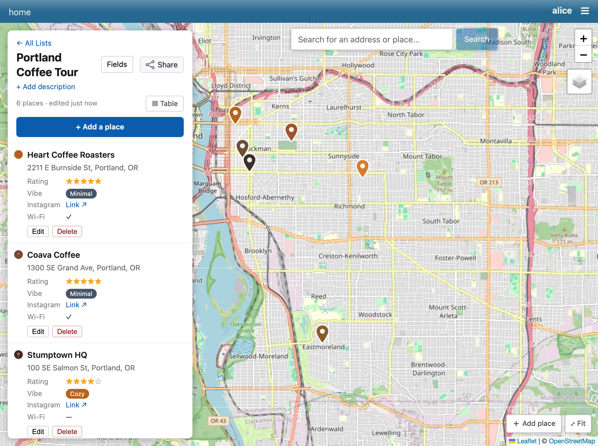
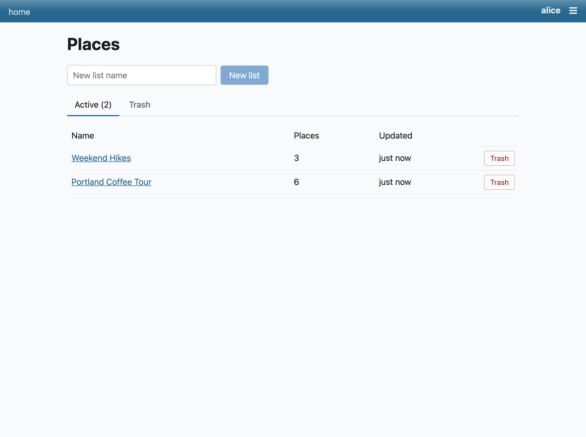
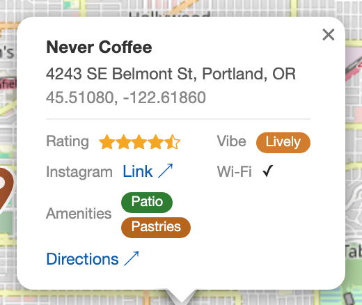
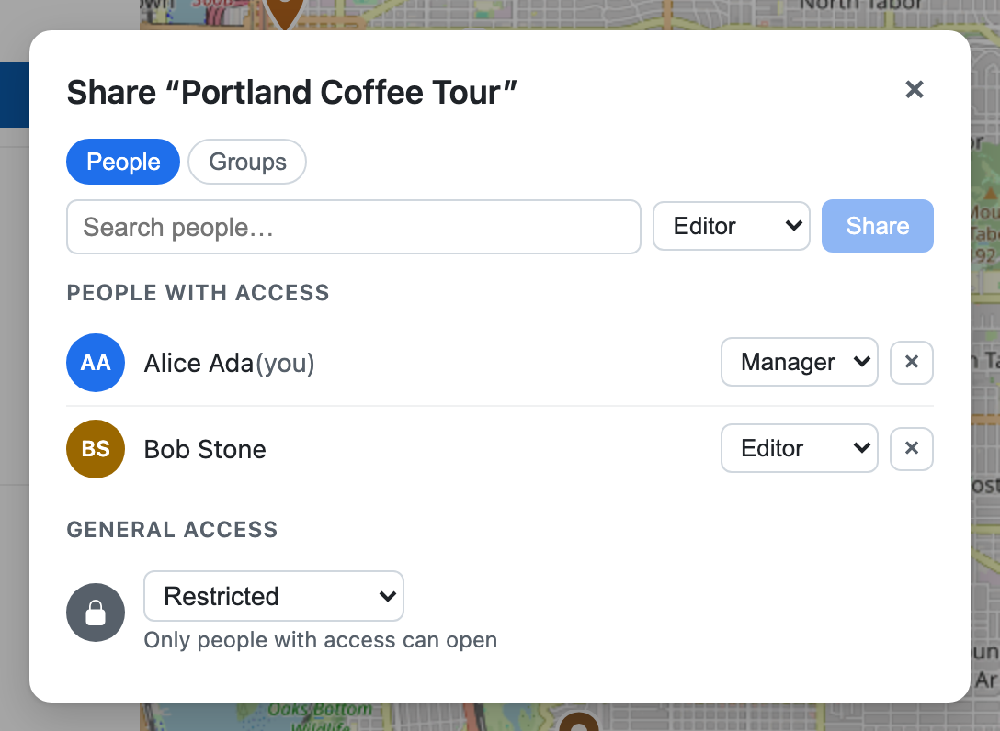
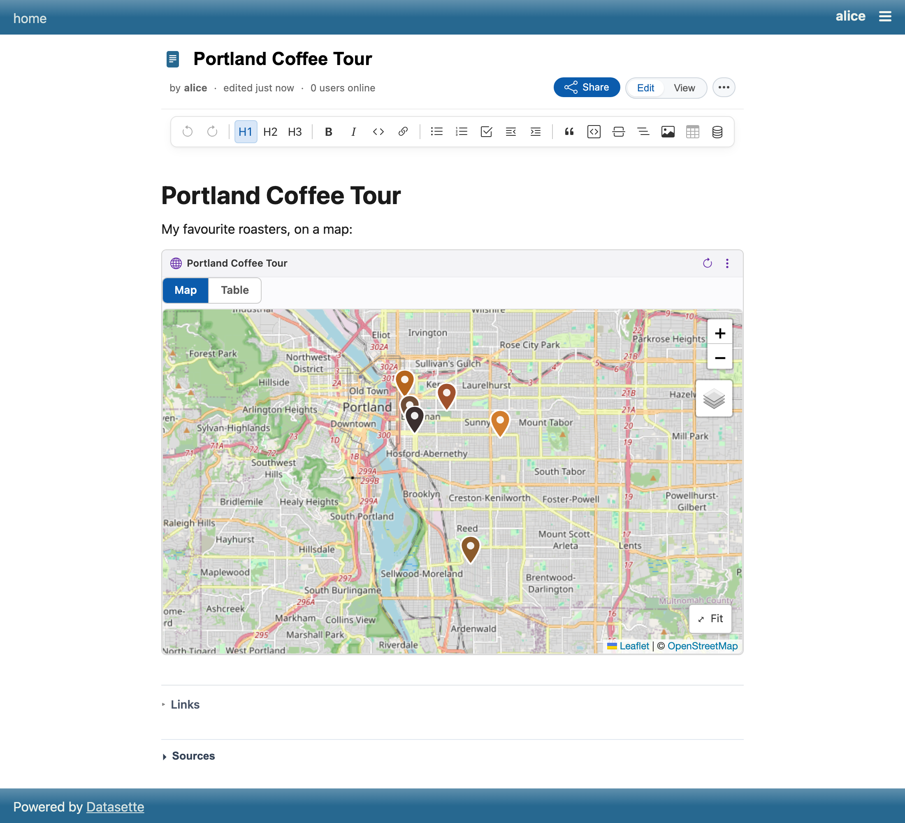
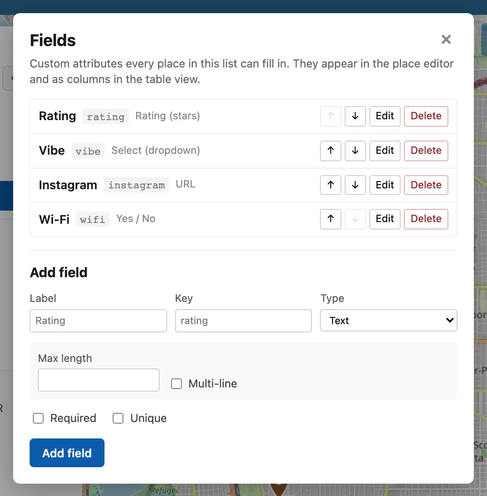
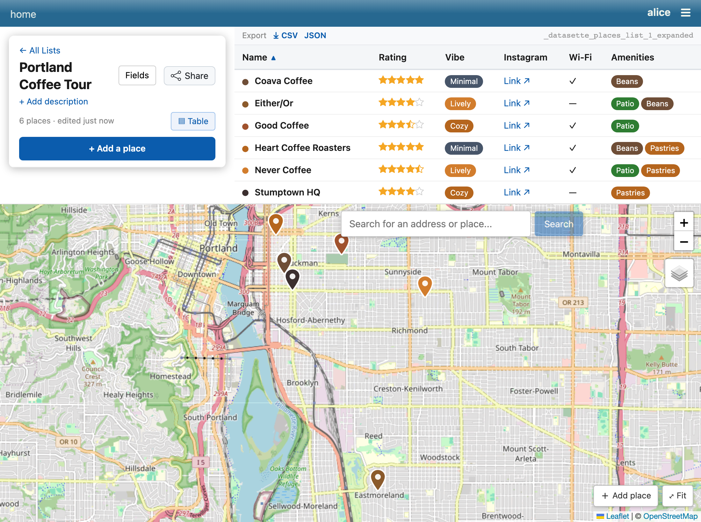
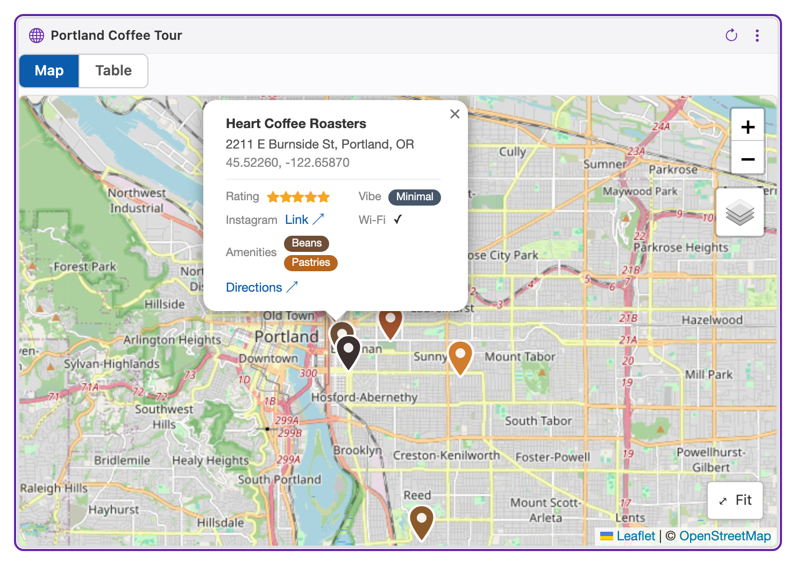
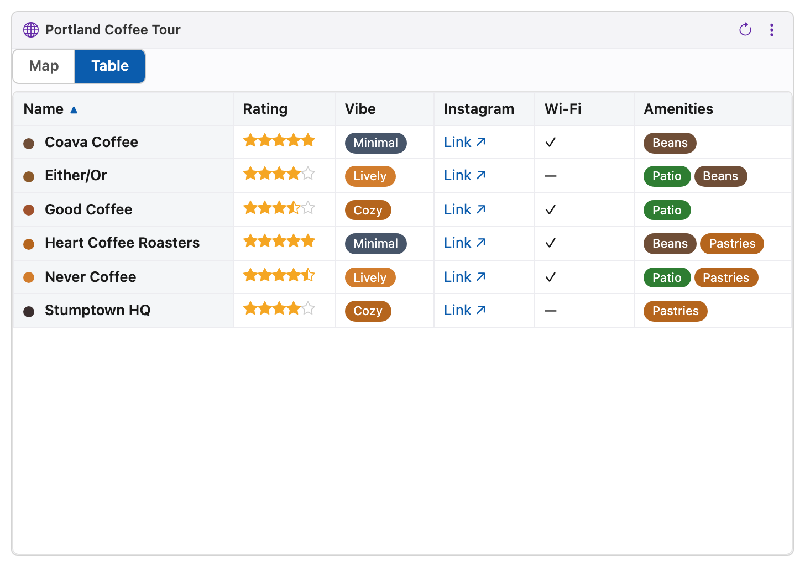

# datasette-places

Experimental plugin for making maps of addresses in Datasette.

Create lists of places, drop them on a map, and share each list with people or
groups.



The Places index lists every map you can see, with place counts:



Click a marker for its details, or share a list with collaborators:





A place list can also be embedded as a block inside a
[datasette-paper](https://github.com/datasette/datasette-paper) document:



## Custom fields

Each list can declare its own **custom fields** — extra attributes every place
in the list can fill in, beyond the built-in name/address/notes/color. Open the
**Fields** panel (managers only) to add fields:



Each field has a `key`, a label, and a **type** that controls how it's edited
and displayed:

| Type | Stored value | Editor / display |
|------|--------------|------------------|
| `text` | string | text / textarea |
| `number` | number | number input (optional min/max/step/unit) |
| `url` | string | link |
| `rating` | number | ★ out of `max` (default 5); supports half stars |
| `select` | option value(s) | dropdown (or checkboxes if `multiple`) → colored chip(s) |
| `color` | hex string | color picker → swatch |
| `icon` | icon name | Bootstrap-icon glyph |
| `boolean` | true/false | checkbox → ✓ / — |
| `date` | ISO date | date input → formatted date |

Fields can be marked **required** or **unique**. Values are validated on the
server (range, option membership, URL format, …); `unique` is enforced by a
per-list partial index.

Place values are stored as a single JSON object in each place's
`metadata_json`, and a per-list SQL view
(`_datasette_places_list_<id>_expanded`) expands each field into its own column
via `json_extract`. The same fields drive a spreadsheet-style **Table view** of
the list, toggled from the floating panel. The table header links to **CSV** and
**JSON** exports of that view:



Field values also show in a place's map popup — including inside a
[datasette-paper](https://github.com/datasette/datasette-paper) block embed,
which offers its own Map / Table toggle:





## Development

### Screenshots

`docs/screenshots/*.png` are generated and committed. To regenerate them:

```bash
just shots              # all shots
just shots map share    # a subset, by name
```

This builds the production frontend, boots a throwaway Datasette (with the
`paper` extra, so the paper-embed shot works) with seeded demo data, and drives
headless Chromium to produce deterministic PNGs. Map tiles are fetched once and
cached under `frontend/scripts/shots/.tile-cache/` (gitignored); after the first
run the shots render offline. It is a manual local task (not run in CI) — re-run
and confirm `git status` shows no diff before committing. See
`frontend/scripts/` for the harness.
